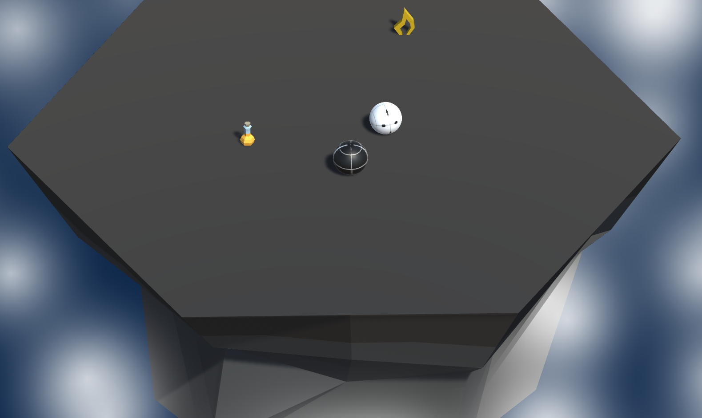

# mini-game

## Setup

Run the executable "prototype_4"

Press "Joaca" to play 

When the game is over pres "Iesire"

## Playing instructions:

1. Press space to jump

2. Use arrows to rotate the island

3. Press "x" to change to mouse control

## Rules:

The player must find a way to hit and throw off the platform the enemy.

The difficulty is randomly generated ( there are more possible types of enemies ).

There are magic potions randomly spawned that may help the player win by increasing his power.

## Spoiler Images:

Menu 1:

